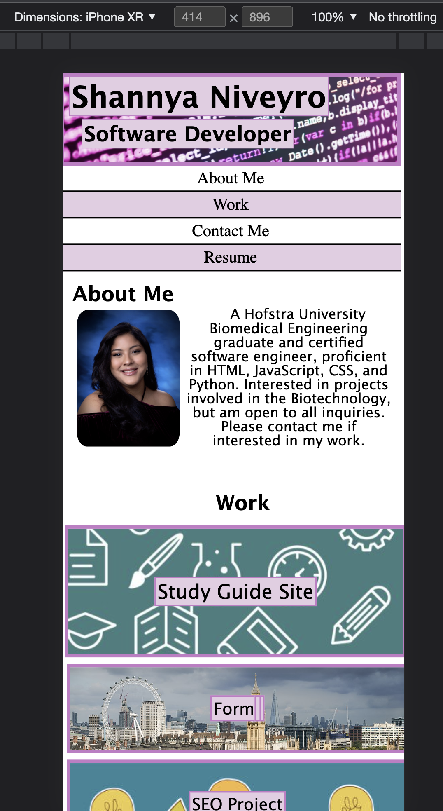
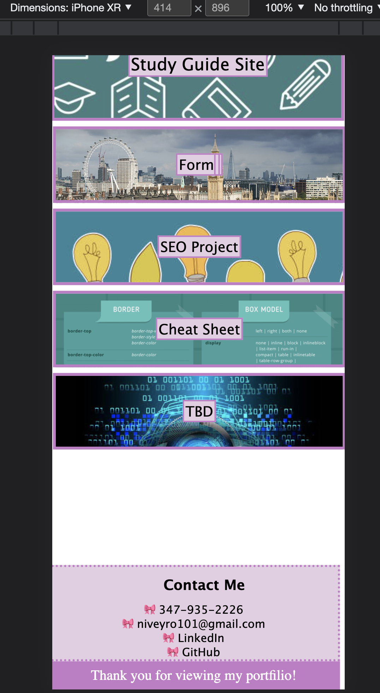
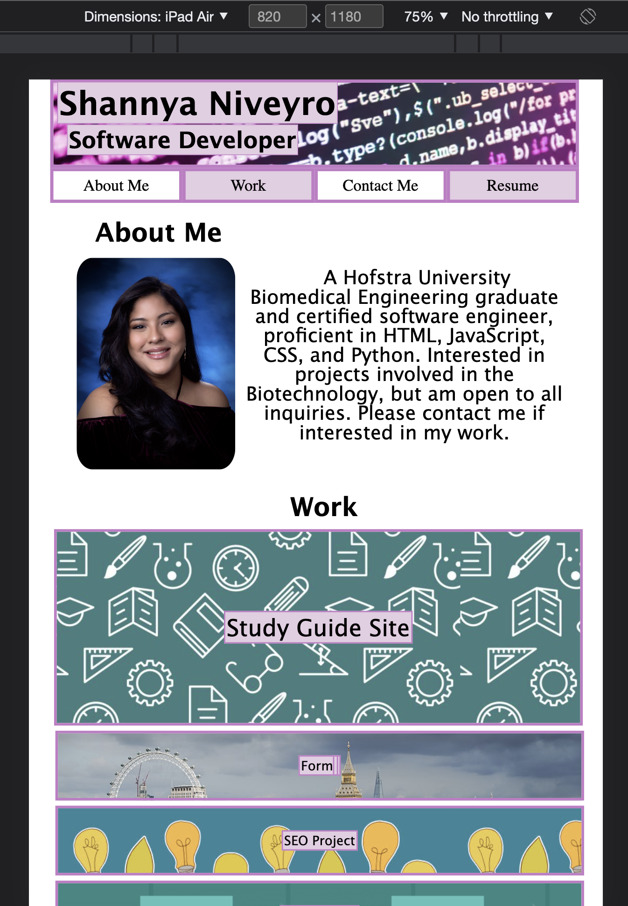
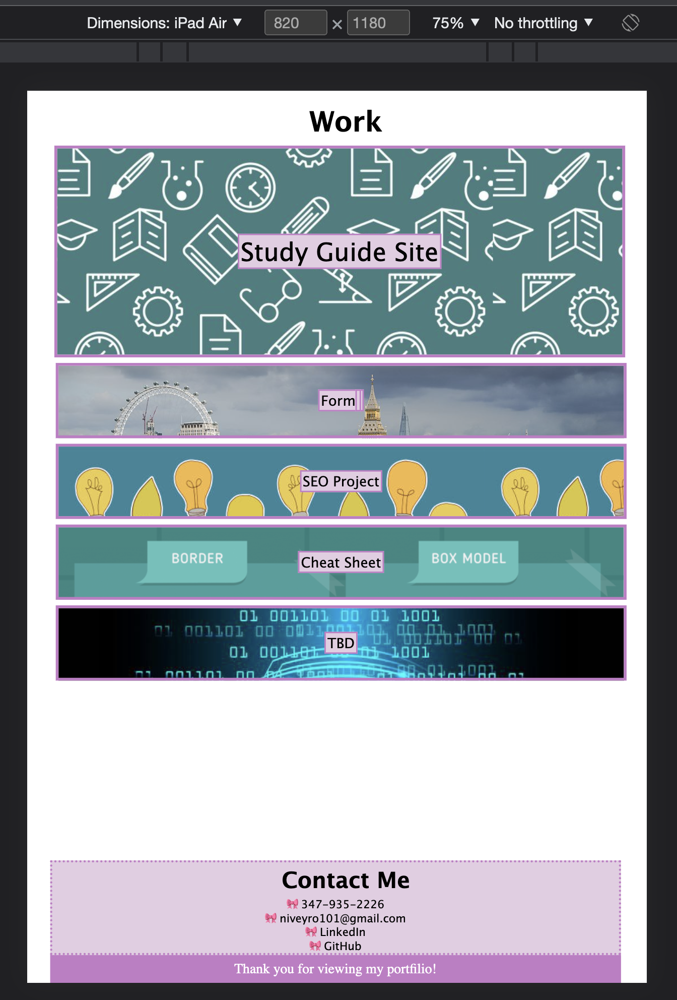
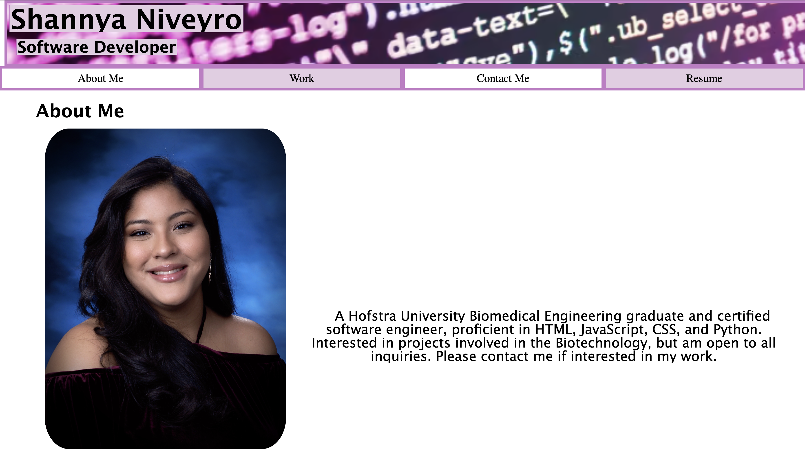
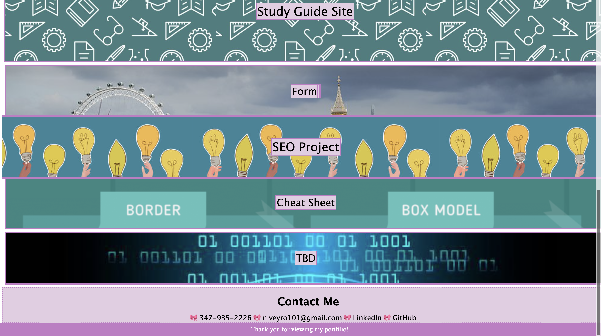

## Professional Developer Portfolio

## Description
A site meant for possible clients or professionals hiring to view the work of a software developer along with a short biography, profile picture, resume, and means of contacting them.

### View in mobile mode from iPhone:

### View in mobile mode from portrait tablet:

### View from a desktop:

## Installation
Extra equipment is not needed to view this project.

## Usage
This site provides a much more organized manner to present a developer's word to those looking to hire them for services or as an employee.

## Roadmap
I would add JavaScript to the site when learned to make it more interactive and possibly log inquiries.

## Project status
In progress.
